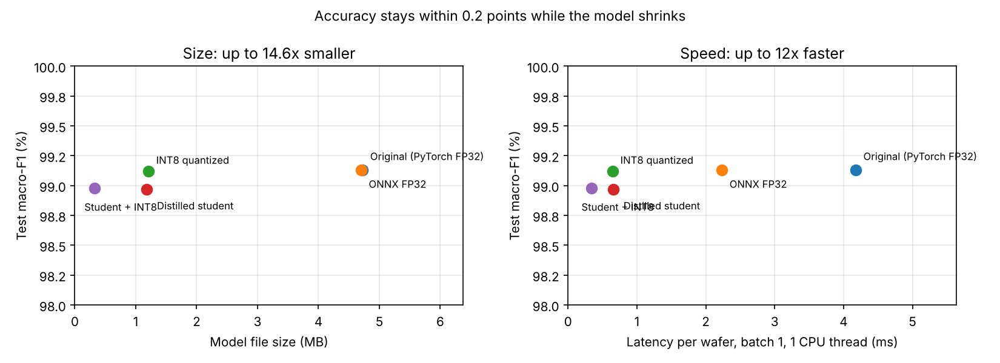

# On-Device Model Optimization: Quantization and Distillation

Makes the [wafer defect classifier](https://github.com/abdulkarimali0001/wafer-defect-classifier) **14.6× smaller and 12× faster** while keeping test macro-F1 within 0.2 points, using ONNX export, INT8 static quantization, and knowledge distillation. These are the techniques used to run AI on phones, cameras, and inspection equipment instead of large servers.

> 웨이퍼 불량 분류 모델을 ONNX 변환, INT8 정적 양자화, 지식 증류(knowledge distillation)로 경량화한 프로젝트입니다. 정확도(Macro-F1) 하락을 0.2%p 이내로 유지하면서 모델 크기를 14.6배 줄이고 추론 속도를 12배 높였습니다. 온디바이스 AI와 엣지 추론에 필요한 핵심 기술을 다룹니다.

## Why this matters

Running AI directly on a device (a phone, or a camera on an inspection tool) avoids network delay and keeps data local, but the device has little memory and compute. A model that's smaller and uses 8-bit integers instead of 32-bit floats needs less memory bandwidth and runs faster on cheap hardware. On-device AI is a major focus at Samsung, and memory bandwidth is exactly what SK hynix's products are built around.

## Results

All variants are scored on the same 5,701 held-out test wafers. Latency is for one wafer at a time on one CPU thread.

| Variant | Parameters | File size | Latency (ms) | Throughput (wafers/s) | Test macro-F1 | Exact match |
| --- | --- | --- | --- | --- | --- | --- |
| Original (PyTorch FP32) | 1,175,272 | 4.73 MB | 4.18 | 192 | 0.9913 | 98.51% |
| ONNX Runtime FP32 | 1,175,272 | 4.70 MB | 2.23 | 466 | 0.9913 | 98.51% |
| **ONNX INT8 (static quantization)** | 1,175,272 | **1.21 MB** | **0.65** | 1,413 | **0.9912** | 98.47% |
| Distilled student FP32 | 295,032 | 1.18 MB | 0.66 | 1,605 | 0.9897 | 98.11% |
| **Student + INT8** | 295,032 | **0.32 MB** | **0.34** | **3,131** | 0.9898 | 98.14% |



**What the results show**

1. **Switching runtime is free speed.** The same weights run about 1.9× faster in ONNX Runtime than in eager PyTorch, with identical accuracy.
2. **INT8 quantization is almost lossless here.** The model is 3.9× smaller and 6.4× faster, and macro-F1 drops by only 0.0001. Calibrating activations on 512 real wafers is what keeps accuracy this close.
3. **Distillation and quantization stack.** The student network has 4× fewer parameters; quantizing it as well gives a 0.32 MB model that runs 12× faster than the original and still scores 0.990 macro-F1.
4. **Which one to deploy:** if accuracy matters most, INT8 of the full model (no measurable loss). If memory is the limit, such as on a microcontroller or a small edge device, the 0.32 MB student.

## Methods

| Technique | What it does | Settings |
| --- | --- | --- |
| ONNX export | Converts the PyTorch graph to a portable format with an optimized runtime | opset 17, dynamic batch size |
| Static INT8 quantization | Stores weights and activations as 8-bit integers. Activation ranges come from calibration data | ONNX Runtime QDQ format, per-channel weights, 512 calibration wafers from the training set |
| Knowledge distillation | Trains a small "student" to match the big "teacher" model's probabilities as well as the true labels | Student width 16 (vs 32), loss = 0.5 × true labels + 0.5 × teacher soft targets, 10 epochs |

Calibration data comes only from the training split, so the test score stays honest.

## How to run

```bash
pip install -r requirements.txt
# needs the dataset from https://github.com/abdulkarimali0001/wafer-defect-classifier cloned next to this folder
DATA=../wafer-defect-classifier/data/Wafer_Map_Datasets.npz
python src/distill.py --data $DATA --epochs 10    # about 20 minutes on CPU
python src/optimize.py --data $DATA               # export, quantize, benchmark, plot
```

## Project structure

```
src/distill.py    knowledge distillation (teacher -> student)
src/optimize.py   ONNX export, INT8 quantization, accuracy/size/latency benchmark
src/plot.py       trade-off chart
src/model.py, src/data.py   shared with the training project
models/           .pt and .onnx files for every variant
results/          comparison.csv, comparison.json, tradeoff.png
```

## Next steps

- Quantization-aware training, to see if the student can recover its last 0.15 points.
- Benchmark on a phone or Raspberry Pi with ONNX Runtime Mobile.
- Serve the INT8 model from the [API project](https://github.com/abdulkarimali0001/wafer-defect-api).
